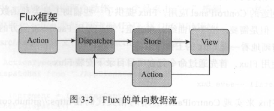

# FLUX

## 1. 什么是flux？

   Flux 是一种架构模式；是单向数据流的鼻祖；redux的前身；如Reflux\Fluxible等；flux推翻了MVC框架；（MVC见另外一篇文档）

## 2. flux 有4部分组成：Action、Dispatcher、Store、View.   

### Store  

flux 中的 Store 类似于 model，用来存储数据 以及 对数据进行操作；其实也可以叫他data但是太土了

```js
const data = {
  'name': '',
  'age': 10,
};
const DataStore = Object.assign({}, EventEmitter.prototype, {
  getCounterValues: function() {
    return data;
  },
  emitChange: function() {
    this.emit('change');
  },
});
```

### Action

Action 就是动作，这个动作可以是加减乘除等等，当需要增加一个功能的时候只需要增加一个action即可

```js
const INCREMENT = 'increment';
const DECREMENT = 'decrement';
export const increment = (name) => {
  AppDispatcher.dispatch({
    type: INCREMENT,
    name // 这里对应的是仓库的属性值，表示这个动作改变的是这个值
  });
};
........

```

### Dispatcher

Dispatcher 是flux 的核心，加上这个Dispatcher一切变得神奇

```js
import {Dispatcher} from 'flux';
export default new Dispatcher();
```

当我们设置好action和store之后我们需要把两者关联到Dispatcher，这样一来当我们触发相应的action时 dispatch 就会去找对应的操作修改store

> Action 	中 我们这样绑定

```js
export const increment = (name) => {
  Dispatcher.dispatch({
    type: 'increment',
    name // 这里对应的是仓库的属性值，表示这个动作改变的是这个值
  });
};
```

> Store 中我们这样绑定

```js
DataStore.dispatchToken = Dispatcher.register((action) => {
  if (action.type === 'increment') {
    data[action.name] ++;
    DataStore.emitChange();
  }
});
```

### View

view怎么触发？

```js
import {increment} from 'actions' // 上面我们定义的
<button onClick={increment('name')}>修改</button>
```



## flux 的不足(p54-p55)

1. Store 之间依赖关系

在 Flux的体系中，如果两个 Store之间有逻辑依赖关系，就必须用上 Dispatcher的 waitFor 函数。 在上面的例子中我们已经使用过 waitFor 函数， SummaryStore对 action类型的 处理，依赖于CounterStore已经处理过了。 所以，必须要通过waitFor函数告诉Dispatcher, 先让 CounterStore处理这些 action对象，只有 CounterStore搞定之后 SummaryStore才 继续。

SummaryStore 如何标识 CounterStore 呢?靠的是 register 函数的返回值 dispatch- Token，而 dispatchToken 的产生，当然是 CounterStore 控制的，换句话说，要这样设计:

- CounterStore 必须要把注册回调函数时产生的 dispatchToken 公之于众;
- SummaryStore 必须要在代码里建立对 CounterStore 的 dispatchToken 的依赖。

2. 难以进行服务器端渲染

3. Store 混杂了逻辑和状态

   

Store 封装了数据和处理数据的逻辑，用面向对象的思维来看，这是一件好事，毕竟对象就是这样定义的 。 但是，当我们需要动态替换一个 Store 的逻辑时，只能把这个 Store 整体替换掉，那也就无法保持 Store 中存储的状态.

读者可能会问，有什么使用场景是要替换 Store 呢?

在开发模式下，开发人员要不停地对代码进行修改，如果 Store在某个状态下引发了bug，如果能在不毁掉状态的情况下替换 Store 的逻辑，那就最好了，开发人员就可以不断地改进逻辑来验证这个状态下 bug 是否被修复了 。还有一些应用，在生产环境下就要根据用户属性来动态加载不同的模块，而且动态
加载模块还希望不要网页重新加载，这时候也希望能够在不修改应用状态的前提下重新 加载应用逻辑，这就是热加载(HotLoad)，在第 12章会详细介绍如何实现热加载。

这4张图把工作流描述的很清晰：

https://www.yuque.com/flying.ni/the-tower/tvzasn

