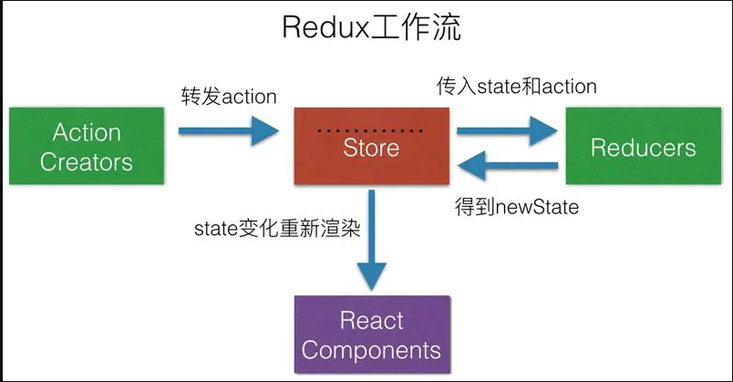

# Redux

与flux 不同的是redux没有以dispatcher为中心

redux 由4部分组成，分别是**Action | Store | Reducer | View**

## Reducer

> Reducer必须是一个纯函数，也就是说函数返回的结果必须由参数state和action决定，返回一个新的state, 而且不产生任何副作用也不能修改state和action对象

```js
(state,action) => {
    return {...state, [caption]: state[caption] + 1};
}
```

## Action

与FLUX不同,redux 的 action只返回一个对象

```js
export const increment = (payload) => {
  return {
    type:"做什么事情",
    payload: "要改的那个state"
  }
}
```

## Store 

- Redux提供createStore这个函数，用来生成Store.就是保存数据的地方

```js
import {createStore} from 'redux';
import reducer from './Reducer.js'
const data = {
  'First': 0,
  'second': 1
}
const store = createStore(reducer,data)
export default store
```

- state（如First、second）就是store里面存储的数据，store里面可以拥有多个state，Redux规定一个state对应一个View,只要state相同，view就是一样的，反过来也是一样的，可以通过**store.getState( )**

  ```js
  store.getState('First') // 0
  store.getState('second') // 1
  ```

  

## View

- store.dispatch( )是view发出Action的唯一办法

  ```js
  function 加一 () {
  	store.dispatch(action.increment)
  }
  <button onclick={加一}>+</button>
  ```

  

完整代码

```js
import { createStore,combineReducers  } from "redux";

const initialState = {
  cart: [
    {
      product: 'bread 700g',
      quantity: 2,
      unitCost: 90
    },
    {
      product: 'milk 500ml',
      quantity: 1,
      unitCost: 47
    }
  ]
}
const ADD_TO_CART = 'ADD_TO_CART'
const cartReducer = function(state=initialState, action) {
  switch(action.type) {
    case ADD_TO_CART: {
      return {
        ...state,
        cart: [...state.cart, action.payload]
      }
    }
    default: 
    return state;
  }
}
const allReducer = {
  shoppingCart: cartReducer
}
const rootReducer = combineReducers(allReducer)


function addToCart(product, quantity, uniCost) {
  return {
    type: ADD_TO_CART,
    payload: {product, quantity, uniCost}
  }
}

const store = createStore(rootReducer);

console.log("initial state: ", store.getState());

let unsubscribe = store.subscribe(() => console.log(store.getState()))
store.dispatch(addToCart('Coffee 500gm', 1, 250));
store.dispatch(addToCart('Flour 1kg', 2, 110));
store.dispatch(addToCart('Juice 2L', 1, 250));
unsubscribe();
```


## Redux 源码

```js
let createStore = (reducer) => {
    let state;
    //获取状态对象
    //存放所有的监听函数
    let listeners = [];
    let getState = () => state;
    //提供一个方法供外部调用派发action
    let dispath = (action) => {
        //调用管理员reducer得到新的state
        state = reducer(state, action);
        //执行所有的监听函数
        listeners.forEach((l) => l())
    }
    //订阅状态变化事件，当状态改变发生之后执行监听函数
    let subscribe = (listener) => {
        listeners.push(listener);
    }
    dispath();
    return {
        getState,
        dispath,
        subscribe
    }
}
let combineReducers=(renducers)=>{
    //传入一个renducers管理组，返回的是一个renducer
    return function(state={},action={}){
        let newState={};
        for(var attr in renducers){
            newState[attr]=renducers[attr](state[attr],action)

        }
        return newState;
    }
}
export {createStore,combineReducers};
```

